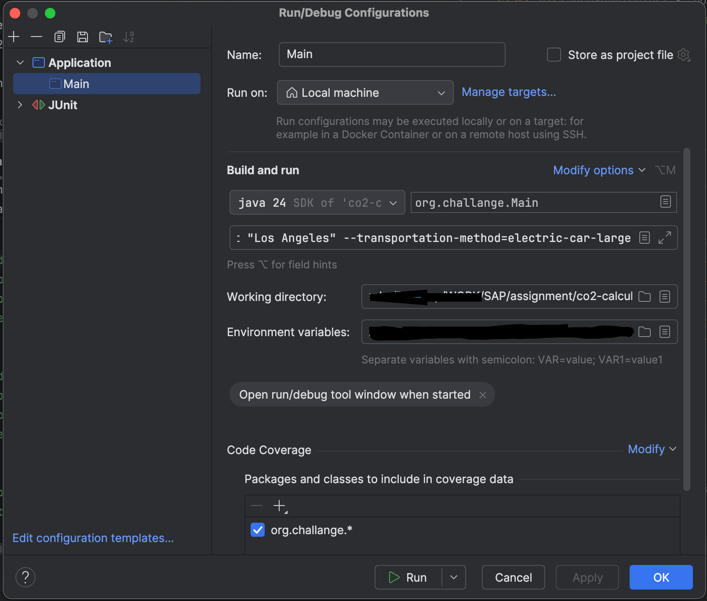

# CO2‑Calculator

A tiny command‑line tool that

* accepts a **transportation method** (e.g. `diesel-car-medium`) and two **cities** (`start`, `end`),
* fetches the road distance between them via the **OpenRouteService** (ORS) geocoding + matrix API,
* multiplies that distance by the appropriate gram‑per‑kilometre factor, and
* prints the result as **kilograms of CO2‑equivalent**.

Everything is pure Java17 + Maven; the only non‑JDK dependency is JUnit/Mockito/WireMock for tests (scope `test`).

### 4 main categories to develop:

- A) core calculation: calculate CO2-emission based on car type and given distance in km
- B) CLI input: process the input (start and destination places, vehicle type, edge cases, etc.)
- C) Geo-API handling: process REST API endpoints for getting distance between positions
- D) Tests: write Unit tests to cover the functionality + edge cases

Additional packages installation (see pom.xml)
- json: for easier resolve of json response from external API (otherwise ugly regex or 'indexOf'-matching)
- junit: for unit-tests to cover basic functionality
- mockito: for tests, later also for integration tests

---

## Folder layout

```
co2-calculator/
├── pom.xml                     # Maven build
├── README.md                   # current README.md file
└── src
    ├── main
    │   └── java
    │       └── org/challange
    │           ├── Main.java   # start of the tool
    │           ├── cli/
    │           │   ├── ArgumentParser.java
    │           │   └── CLIOptions.java
    │           ├── core/
    │           │   ├── EmissionFactors.java
    │           │   └── CO2Calculator.java
    │           └── api/
    │               ├── CommonAPIService.java
    │               ├── GeocodingService.java
    │               ├── DistanceService.java
    │               └── dto/Coordinates.java
    └── test
        └── java/…               # unit tests (JUnit + WireMock)
```

---

## Prerequisites

| Tool        | Version         | Install guide                                                                          |
| ----------- |-----------------|----------------------------------------------------------------------------------------|
| Java JDK    | **17 or newer** | e.g. [https://adoptium.net](https://adoptium.net)                                      |
| Maven       | **3.9+**        | [https://maven.apache.org/download.cgi](https://maven.apache.org/download.cgi)         |
| ORS account | free            | [https://openrouteservice.org](https://openrouteservice.org) – generate an **API key** |

### Environment variable

```text
ORS_TOKEN=<your‑API‑key>
```

---

## Building & Testing

The same commands work on macOS/Linux/Windows (Git, Bash or PowerShell):

```bash
# compile + package (fat‑jar in target/)
mvn clean package

# run all unit tests
mvn test
```

Maven downloads JUnit, Mockito and WireMock only for the test phase; the final JAR stays minimal.

---

## Running the tool

```bash
java -cp target/classes org.challange.Main <transportation-method> <start-city> <end-city>
```

Alternatively, after installing maven and in order to not put environment variable manually:
- insert **ORS_TOKEN** into .env file in the root
- run from the terminal following command (you can write your own prompt for start, destination, transportation type):
```bash
  export ORS_TOKEN=$(grep ORS_TOKEN .env | cut -d= -f2-)
  mvn exec:java -Dexec.mainClass=org.challange.Main \
  -Dexec.args="petrol-car-large Munich Berlin"
```

**Examples**

```bash
# Hamburg → Berlin by medium diesel car
java -cp target/classes org.challange.Main diesel-car-medium Hamburg Berlin

# Same, but with named flags (order and separators are flexible)
java -cp target/classes org.challange.Main \
     --end=Berlin --transportation-method diesel-car-medium --start Hamburg
```

Output:

```
Your trip caused 49.2kg of CO2-equivalent.
```

---

## How the API calls work

### 1) Geocoding – city → lon/lat

* **GET** `https://api.openrouteservice.org/geocode/search/get`
* Query params

    * `text=<city name>`
    * `layers=locality` – limit to city / town level
    * `api_key=<ORS_TOKEN>`
* Response: we read `features[0].geometry.coordinates = [lon,lat]`.

### 2) Matrix – lon/lat x2 → km

* **POST** `
  https://api.openrouteservice.org/v2/matrix/driving-car`
* JSON body

```json
{
  "locations": [[lonA, latA], [lonB, latB]],
  "metrics":   ["distance"],
  "units":     "km"
}
```

* Header `Authorization: <ORS_TOKEN>`
* Response: first distance is `distances[0][1]` (in km).

Both calls time‑out after 10s; any non‑200 response fails gracefully and is reported to the user.

---

## Possible Extensions of the Project

* more details for vehicles → use as interfaces, not Map key-values pairs (if more details are given)
* separate JSON parser
* additional API requests